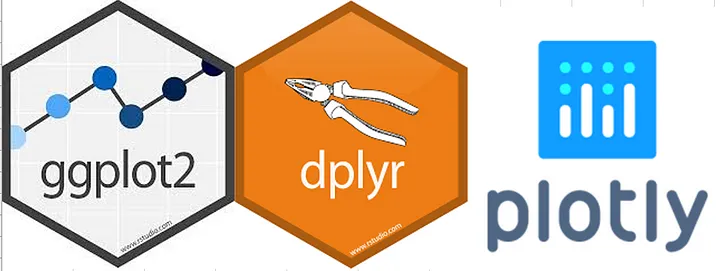

# This is Wenjun's awesome website

Welcome to Wenjun's awesome website, an interactive portal showcasing the convergence of data analytics, visualization, and public health insights. This site is built using R Markdown and is powered by R Shiny, providing a dynamic and user-friendly interface for exploring complex data sets.

The website features advanced data visualizations created with Plotly, an open-source graphing library that enables interactive, publication-quality graphs online. Wenjun utilizes Plotly to transform static data from New York City's public datasets into engaging and informative visual narratives.

Visitors can explore a range of visualizations, including scatter plots highlighting restaurant health inspection scores across Manhattan and box plots comparing the scores by borough. Through these visualizations, the site provides a unique perspective on public health and safety standards in the food industry across different neighborhoods.

Additionally, the site delves into the New York City Airbnb market, presenting data on rental prices, types, and ratings in a visually compelling format. Scatter plots reveal the geographical distribution of rental prices, while box plots and bar graphs offer insights into the pricing trends and popularity of different neighborhoods.

In summary, Wenjun's awesome website is more than just a showcase of data visualization skills. It's an interactive platform that combines rigorous data science with a clear and accessible narrative, reflecting Wenjun's passion for public health, data analysis, and community service.

