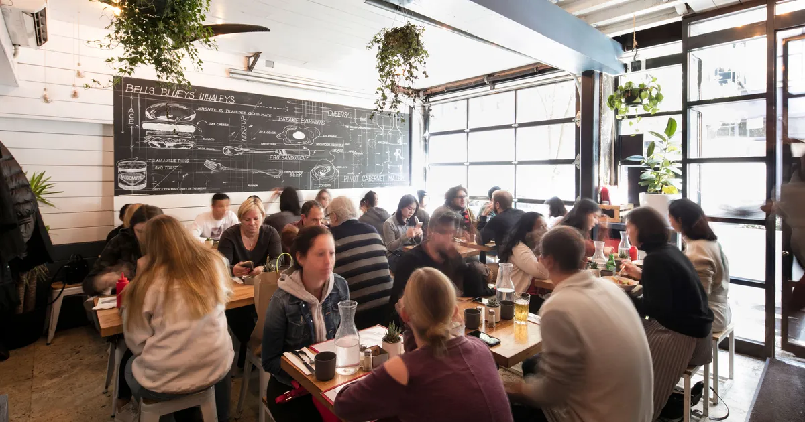

# Wenjun's awesome website

I am currently a second year student studying Biostatistics in Columbia University. My track is public health data science. I come from China and currently lived in Manhattan.

I like all the outdoor activities. I use [google](https://www.google.com/) all the time to do data science. 

Here's a direct link to the about page: [about](about.html)

I also made a bonus page about my experience [experience](experience.html)

# New Section!

## Visualization 
[Here's](plotly.html) a page with plotly plots and code in class (Project about the NYC Restaurants) 

## Pokemon Fun Fact
[FUN](Machine_learning.html) Fact some fun fact about the pokemon statistics

## Child care inspection project
One of the data science project corporate with my amazing teammates [Project](https://pl2848.github.io/final_project.github.io/)

